# Networking – Complete Usage Guide

A powerful, extensible, and type‑safe networking library for Swift.  
Provides both **async/await** and closure‑based APIs, chainable syntax, SSL certificate pinning, file download/upload, response caching, offline awareness, interceptors with retry & exponential back‑off, and more.

> **Deployment Target:** iOS 15+, macOS 12+, tvOS 15+, watchOS 8+

---

## Table of Contents
1. [Installation](#installation)  
2. [Core Concepts](#core-concepts--glossary)  
3. [Quick Start](#quick-start)
   * [Completion-Handler Style *(UIKit-friendly)*](#1-completion-handler-style-uikit-friendly)
   * [Modern async/await](#2-modern-asyncawait)
   * [Fluent Chain API](#3-fluent-chain-api)
   * [Common Extras (copy-paste ready)](#4-common-extras-copy-paste-ready)
   * [Troubleshooting Checklist](#5-troubleshooting-checklist)
4. [HTTPHeaders](#httpheaders)
   * [TL;DR](#1-tldr)
   * [Design Goals](#2-design-goals)
   * [API Reference](#3-api-reference)
   * [Cookbook](#4-cookbook)
   * [Possible Extensions](#5-possible-extensions)
   * [Integration Tips](#6-integration-tips)
5. [HTTPMethod](#httpmethod)
   * [Quick Look](#1-quick-look)
   * [Cheat-Sheet](#2-cheat-sheet)
6. [StatusCodeType](#statuscodetype)
   * [Cheat-Sheet](#1-cheat-sheet)
   * [StatusCodeType Usage](#2-statuscodetype-usage)
7. [Making Requests](#making-requests)  
   * [URL-Only (5-liner)](#1-url-only-5-liner)
   * [RequestConfig - declarative endpoint object](#2-requestconfig--declarative-endpoint-object)
   * [Fluent Chain API](#3-fluent-chain-api-1)
   * [Pure async/await](#4-pure-asyncawait)
   * [Common Parameters Cheat-Sheet](#5-common-parameters-cheat-sheet)
   * [Error Handling Pattern](#6-error-handling-pattern)
8. [Responses with `NetworkingResponse`](#responses-with-networkingresponse)  
   * [Reading success or failure](#1-reading-success-or-failure)
   * [Accessing headers, status code & raw payload](#2-accessing-headers-status-code--raw-payload)
   * [Chaining heavy work off the main thread](#3-chaining-heavy-work-off-the-main-thread)
   * [Transforming a response](#4-transforming-a-response)
   * [Debug description](#5-debug-description)
   * [Sample end-to-end flow](#6-sample-end-to-end-flow)
   * [Cheat-sheet](#7-cheat-sheet)
9. [Serialization](#serialization)
   * [`responseDecodable`  —  JSON → Model](#1-responsedecodable--json--model)
   * [`responseVoid`  —  “I-only-care-that-it-worked”](#2-responsevoid--i-only-care-that-it-worked)
   * [`responseData`](#3-responsedata)
   * [`responseString`](#4-responsestring)
   * [Writing your own serializer](#5-writing-your-own-serializer)
   * [Async/await equivalents](#6-asyncawait-equivalents)
   * [Choosing the right serializer](#7-choosing-the-right-serializer)
10. [Interceptors](#interceptors)  
    * [Request Adaptation](#1-request-adaptation)
    * [Retry & Exponential Back‑off](#2-retry--exponential-backoff)
    * [Wiring the Interceptor](#3-wiring-the-interceptor)
    * [Best Practices Checklist](#4-best-practices-checklist-)
    * [Troubleshooting](#5-troubleshooting)
11. [Session Management](#session-management)  
    * [`Session` value type](#1-session-value-type)
    * [`SessionProvider` – secure, thread-safe storage](#2-sessionprovider--secure-thread-safe-storage)
    * [`SessionProvider` Example](#3-sessionprovider-example)
    * [Security Best Practices](#4-security-best-practices-)
    * [Thread-Safety & Performance](#5-thread-safety--performance) 
    * [Extending SessionProvider](#6-extending-sessionprovider)
    * [Common Pitfalls & Fixes](#7-common-pitfalls--fixes)
12. [Certificate Pinning](#certificate-pinning)
    * [Usage](#1-usage)
    * [Directory Layout](#2-directory-layout)
    * [Security Best-Practices](#3-security-best-practices-)
    * [Troubleshooting](#4-troubleshooting)
    * [Automated Pin Generation Script (Optional)](#5-automated-pin-generation-script-optional)
13. [Caching](#caching)
    * [`CachePolicy` – three simple switches](#1-cachepolicy--three-simple-switches)
    * [`ResponseCaching` – the protocol](#2-responsecaching--the-protocol)
    * [`NetworkCache` – the in-memory default](#3-networkcache--the-in-memory-default)
    * [Request-to-Cache Flow](#4-request-to-cache-flow)
    * [Best-Practice Checklist](#5-best-practice-checklist-)
    * [Common Pitfalls & Fixes](#6-common-pitfalls--fixes)
    * [Summary](#7-summary)
14. [File Transfer – Downloader & Uploader](#file-transfer--downloader--uploader)
    * [Downloader](#1-downloader)
    * [Uploader](#2-uploader)
    * [Best-Practice Checklist](#3-best-practice-checklist-)
    * [Troubleshooting](#4-troubleshooting-1)
    * [Summary](#5-summary)
15. [Connection Monitor](#connection-monitor)
    * [Quick Start](#1-quick-start)
    * [Using With Networking Components](#2-using-with-networking-components)
    * [Sequence Diagram](#3-sequence-diagram)
    * [Best-Practice Checklist](#4-best-practices-checklist-)
    * [Troubleshooting](#5-troubleshooting-1)
    * [Extending ConnectionMonitor](#6-extending-connectionmonitor)
    * [Summary](#7-summary-1)
16. [Network Logger](#network-logger)
    * [Privacy Levels](#1-privacy-levels)
    * [Quick Start](#2-quick-start)
    * [What Gets Logged](#3-what-gets-logged)
    * [cURL Generator](#4-curl-generator)
    * [Integrating With OSLog](#5-integrating-with-oslog)
    * [Performance & Security Notes](#6-performance--security-notes)
    * [Extending the Logger](#7-extending-the-logger)
    * [Summary](#8-summary)
17. [Error Handling](#error-handling)
    * [Case Reference](#1-case-reference)
    * [Usage Patterns](#2-usage-patterns)
    * [Bridging To Foundation Error](#3-bridging-to-foundation-error)
    * [Equality Caveats](#4-equality-caveats)
    * [Sequence Diagram (Failure Path)](#5-sequence-diagram-failure-path)
    * [Best-Practice Checklist](#6-best-practice-checklist-)
    * [Summary](#7-summary-2)
18. [License](#license)

---

## Installation

### Swift Package Manager

*

### Manual

*

---

## Core Concepts & Glossary

| Concept                   | Description                                                                                                                   |
| ------------------------- | ----------------------------------------------------------------------------------------------------------------------------- |
| **Networking**            | Facade class; owns `URLSession`, `Downloader`, `Uploader`, `ConnectionMonitor`, optional `ResponseCaching` & `NetworkLogger`. |
| **SessionProvider**       | Supplies a preconfigured `URLSession` (default, pinned, background, mock).                                                    |
| **RequestConfig**         | Value struct describing URL, method, query/body parameters, headers.                                                          |
| **NetworkResponse<T>**    | Contains `request`, `response`, raw `data`, and `result: Result<T, NetworkError>`.                                            |
| **RequestInterceptor**    | Adapts requests before send; decides retry/back‑off after failure.                                                            |
| **Downloader / Uploader** | File transfer - download / upload - helpers with progress & resume/cancel.                                                    |
| **ConnectionMonitor**     | Wrapper around `NWPathMonitor` exposing reachability (`isReachable`).                                                         |


---

## Quick Start

🚀 Quick Start — 90-Seconds to First Request:

---

### 1. Completion-Handler Style *(UIKit-friendly)*

```swift
import Networking

/// 1. Boot-strap the client (default configuration)
let networking = Networking()

/// 2. Prepare an endpoint
guard let url = URL(string: "https://api.example.com/users") else { 
   return 
}

/// 3. Create your DTO
struct User: Decodable {
    let id: Int
    let name: String
}

/// 4. Fire!
networking.request(url: url) { (response: NetworkResponse<[User]>) in
    switch response.result {
    case .success(let users):
        print("👥 Loaded users:", users)
    case .failure(let error):
        print("❌ Networking error:", error)
    }
}
```

✅ Where should you call this?
From any thread. The library marshals the callback back to the queue you
provide (default = `.main`).

### 2. Modern async/await

```swift
import Networking

let networking = Networking()

/// detach a child-task
Task {                               
    /// Build endpoint
    guard let url = URL(string: "https://api.example.com/profile") else { 
      return 
    }

    /// Optional: fine-grained configuration (method, query, headers…)
    let requestConfig = RequestConfig(url: url, method: .get)

    /// Hit the API - returns `NetworkResponse<User>`
    let response: NetworkResponse<User> = await networking.request(requestConfig)

    if let user = response.value {
        print("🎉 Logged-in as:", user.name)
    } else {
        print("🚨 ", response.error ?? .unknown(nil))
    }
}
```
> Tip → Combine with try await if you prefer throwing style:
```swift
do {
    let user: User = try await networking.request(url: url)
} catch {
    handle(error)          /// `error` is already a `NetworkError`
}
```

### 3. Fluent Chain API

```swift
import Networking

guard let url = URL(string: "https://api.example.com/products/42") else { 
   return 
}

networking
    .request(url: url)                   /// or `.request(RequestConfig(...))`
    .responseDecodable(of: Product.self) { response in
        switch response.result {
        case .success(let product):
            print("🛒 Product:", product)
        case .failure(let error):
            print("❗️", error)
        }
    }
    .responseVoid { result in            /// attach more handlers if you want
        print("Finished:", result)
    }
```

Chaining Rules:
| Stage                     | Purpose                        |
| ------------------------- | ------------------------------ |
| `.request(…)`             | build + enqueue the URLRequest |
| `.responseDecodable(of:)` | JSON → `Decodable` model       |
| `.responseVoid()`         | care only about status code    |
| `.cURLLog()` *(bonus)*    | dump request as cURL           |

### 4. Common Extras (copy-paste ready)

Add Static Auth Header:
```swift
var headers = HTTPHeaders.default
headers.add(name: "Authorization", value: "Bearer <token>")
let requestConfig = RequestConfig(url: url, headers: headers)
```

Opt-in Cache (1-hour):
```swift
let policy = CachePolicy(useCache: true,
                         storeCache: true,
                         expireTime: Date().addingTimeInterval(3600))
let response: NetworkResponse<Data> =
    await networking.request(url: url,
                             cachePolicy: policy)
```

Plug Interceptor (token refresh, retry logic):
```swift
struct AuthInterceptor: RequestInterceptor {
    func adapt(_ req: URLRequest) async throws -> URLRequest { … }
    func retry(_ req: URLRequest,
               dueTo error: NetworkError,
               currentRetryCount: Int) async throws -> RetryResult { … }
}

let networking = Networking(interceptor: AuthInterceptor())
```

### 5. Troubleshooting Checklist

| Symptom                  | Checklist                                                     |
| ------------------------ | ------------------------------------------------------------- |
| `.invalidURL`            | URL string correct? Encoded?                                  |
| `.noInternetConnection`  | `ConnectionMonitor().isReachable`? Airplane mode?             |
| `.decodingError`         | Is server really returning JSON? Match your `Decodable` keys? |
| `.requestFailed(401, _)` | Token expired? Use `RequestInterceptor` to refresh.           |


---

## HTTPHeaders

HTTPHeaders – Typed, Case-Insensitive Header Collection: 
`HTTPHeaders` is a tiny utility that gives you **safe, duplicate-free** header
handling while staying compiler-friendly (pure structs, no `Foundation`
dependency outside of `String`).  
It ships with:

* `HTTPHeader` – a single `name / value` pair  
* `HTTPHeaders` – an orderless, case-insensitive set of headers  
* One-liner factory helpers for the most common fields  
* Codable-ready design – nothing `URLRequest`-specific is hidden inside

---

### 1. TL;DR

```swift
var headers = HTTPHeaders([
    .contentType("application/json"),
    .accept("application/json")
])

headers.add(.authorization(bearerToken: token))   /// overwrite or insert
headers.remove(name: "User-Agent")                /// case-insensitive

let dict: [String:String] = headers.dictionary    /// feed to URLRequest
```

### 2. Design Goals

| Goal                          | How it’s achieved                                           |
| ----------------------------- | ----------------------------------------------------------- |
| **No duplicates**             | `update(_:)` replaces by *name.lowercased()*                |
| **Case-insensitive look-ups** | `.index(of:)` lowercases internally                         |
| **Value semantics**           | Both types are `struct` – use `let` freely                  |
| **Swift-only**                | No Obj-C bridging or `CF` APIs                              |
| **Discoverability**           | `.authorization(username:password:)`, `.contentType(_:)`, … |

### 3. API Reference

#### 3.1 HTTPHeader

| Property/Method                      | Purpose                               |
| -------------------------------------|---------------------------------------|
| `init(name:value:)`                  | Manual entry                          |
| `.accept(_ v)`                       | `"Accept"`                            |
| `.acceptCharset(_ v)`                | `"Accept-Charset"`                    |
| `.acceptLanguage(_ v)`               | `"Accept-Language"`                   |
| `.acceptEncoding(_ v)`               | `"Accept-Encoding"`                   |
| `.authorization(username:,password)` | `"Authorization: username, password"` |
| `.authorization(bearerToken:)`       | `"Authorization: Bearer …"`           |
| `.contentDisposition(_ v)`           | `"Content-Disposition"`               |
| `.contentEncoding(_ v)`              | `"Content-Encoding"`                  |
| `.contentType(_ v)`                  | `"Content-Type"`                      |
| `.userAgent(_ v)`                    | `"User-Agent"`                        |

#### 3.2 HTTPHeaders

| Call                               | Effect                                     |
| ---------------------------------- | ------------------------------------------ |
| `init()`                           | Empty set                                  |
| `init([HTTPHeader])`               | Collapses dups, keeps **last**             |
| `init([String:String])`            | Same, convenience for dictionaries         |
| `add(_:) / add(name:value:)`       | Insert **or** replace                      |
| `update(_:) / update(name:value:)` | Alias for `add…`                           |
| `remove(name:)`                    | Delete by case-insensitive key             |
| `dictionary`                       | `["Header":"Value"]`, use for `URLRequest` |

### 4. Cookbook

#### 4.1 Attaching to URLRequest

```swift
var request = URLRequest(url: someURL)
headers.dictionary.forEach { request.setValue($0.value, forHTTPHeaderField: $0.key) }
```

#### 4.2 Building an Accept-Language Automatically

```swift
let preferred = Locale.preferredLanguages
                     .prefix(6)                             /// RFC < 6 items recommended
                     .enumerated()
                     .map { "\($0.element);q=\(1.0 - 0.1*Double($0.offset))" }
                     .joined(separator: ", ")

let headers = HTTPHeaders([ .acceptLanguage(preferred) ])
```

#### 4.3 Subclass-Style Sugar (Optional)

If you often need subscripting, add:
```swift
extension HTTPHeaders {
    subscript(name: String) -> String? {
        get { headers.first { $0.name.caseInsensitiveCompare(name) == .orderedSame }?.value }
        set {
            guard let v = newValue else { remove(name: name); return }
            update(name: name, value: v)
        }
    }
}
```

Usage:
headers["X-Correlation-Id"] = UUID().uuidString

### 5. Possible Extensions

| Idea                               | Sketch                                               |
| ---------------------------------- | ---------------------------------------------------- |
| **ExpressibleByDictionaryLiteral** | `init(dictionaryLiteral elements: (String,String)…)` |
| **Sequence Conformance**           | Iterate over stored `HTTPHeader`s                    |
| **Codable**                        | Derive automatically – nothing special needed        |
| **MIME-type helper**               | `static func json() -> HTTPHeader` etc.              |


### 6. Integration Tips

- Combine with RequestInterceptor – build auth headers in adapt(_:).
- Share across layers – because values are value-types, you can hand them
  over without worrying about reference side-effects.
- No default “Accept-Encoding” – leave it to URLSession to negotiate
  compression unless you have special needs.


---

## HTTPMethod

HTTPMethod - Typed, Upper-cased Enumeration of the 9 RFC 7231 Methods (+ PATCH):
`HTTPMethod` is a tiny `enum` that keeps your request code type-safe,
readable, and free from `"GET"` string typos.

---

### 1. Quick Look

```swift
let httpMethod = HTTPMethod.post.rawValue   // "POST"
```

- Raw-value = uppercase string → drop-in for any URLRequest.
- Conforms to Equatable automatically – if method == .get { … }.

### 2. Cheat-Sheet

(RFC 7231 §4 + patch)
| Method      | Idempotent | Cacheable | Safe | Typical Purpose                        |
| ----------- | :--------: | :-------: | :--: | -------------------------------------- |
| **GET**     |      ✅     |     ✅     |   ✅  | Pure reads / fetching resources        |
| **HEAD**    |      ✅     |     ✅     |   ✅  | Existence / metadata checks            |
| **OPTIONS** |      ✅     |     ❌     |   ✅  | Capability discovery (CORS pre-flight) |
| **TRACE**   |      ✅     |     ❌     |   ✅  | Diagnostic loop-back                   |
| **PUT**     |      ✅     |     ❌     |   ❌  | Full replacement (or create-if-absent) |
| **DELETE**  |      ✅     |     ❌     |   ❌  | Remove resource                        |
| **PATCH**   |      ❌     |     ❌     |   ❌  | Partial update (JSON Patch, etc.)      |
| **POST**    |      ❌     |     ❌     |   ❌  | Submit data / create sub-resource      |
| **CONNECT** |      ❌     |     ❌     |   ❌  | Tunnel (HTTP → TLS) via proxy          |

---


## StatusCodeType

`StatusCodeType` – Semantic Classification of HTTP Status Codes:
`StatusCodeType` is a tiny helper `enum` that groups the raw integer status
codes (100-599) into **7** human-friendly buckets, so your response‐handling
logic can speak **“successful / clientError”** instead of magic numbers.

---

### 1. Cheat-Sheet

| Bucket             | Numeric Range                 | Typical Meaning                                 | Retry Advice             |
|--------------------|-------------------------------|-------------------------------------------------|--------------------------|
| **informational**  | **100-199**                   | Provisional / handshake responses               | Wait for final response  |
| **successful**     | **200-299**                   | Request accepted, body (or not) returned        | ✅ All good              |
| **redirection**    | **300-399**                   | Resource moved, further action required         | Follow `Location` header |
| **clientError**    | **400-499**                   | Fault in request (auth, validation, quota…)     | 🔄 Fix request           |
| **serverError**    | **500-599**                   | Server failed to fulfil a valid request         | 🔁 Retry with back-off   |
| **cancelled**      | `URLError.cancelled` (`-999`) | Locally aborted by app / user                   | —                        |
| **unknown**        | *Everything else*             | Non-standard or out-of-range code               | Inspect / log            |

---

### 2. StatusCodeType Usage

```swift
let responseCode = httpResponse.statusCode

switch responseCode.statusCodeType {
case .successful:
    handleSuccess()
case .clientError:
    showAlert("Check your input")
case .serverError:
    retryWithExponentialBackoff()
case .cancelled:
    print("User cancelled")
default:
    log("Unrecognised code: \(responseCode)")
}
```

---

## Making Requests

📡 Making Requests — All the Flavours Explained:
Every call in the library ends up in **`Networking.request(…)`** – you only
choose **how expressive** you want to be:

| Style                     | Typical UI Layer | Convenience                | Thread-Context |
|---------------------------|------------------|----------------------------|----------------|
| **URL-only**              | one-off screens  | 🍰 super quick             | any            |
| **`RequestConfig`**       | feature modules  | 🛠 fine-grained control    | any            |
| **Fluent Chain**          | large code-bases | 🔗 readable pipelines      | any            |
| **`async/await`**         | Swift-Concur.    | ⏱ shortest happy-path      | inside `Task`  |

> **Tip** – all variants ultimately return **`NetworkResponse<T>`**  
> *(result + metadata)* so you can swap one for another later without refactor hell.

---

### 1. URL-Only (5-liner)

```swift
let loginURL = URL(string: "https://api.example.com/login")!

networking.request(
    url: loginURL,
    method: .post,
    bodyParameters: [
        "username": "john",
        "password": "12345"
    ],
    retryCount: 1               // optional automatic retry
) { (response: NetworkResponse<Token>) in
    handleResponse(response)
}
```
When to use?
Small throw-away calls where you don’t need custom headers, cache, pinning,
etc.

### 2. RequestConfig – declarative endpoint object

```swift
let requestConfig = RequestConfig(
    url: URL(string: "https://api.example.com/search")!,
    method: .get,
    queryParameters: ["q": "swift"],
    headers: HTTPHeaders([
        .accept("application/json"),
        .authorization(bearerToken: token)
    ]),
    cachePolicy: CachePolicy(useCache: true, storeCache: true),
    retryCount: 2
)

networking.request(requestConfig) { (response: NetworkResponse<SearchResult>) in
    handleResponse(response)
}
```

Why bother with a config?
- ✅ Attach once-off headers, cache rules, HTTP method
- ✅ Unit-testable: pass the same cfg to a stub/spy
- ✅ Serialize it (Codable) for offline queuing


### 3. Fluent Chain API

```swift
let requestConfig = RequestConfig(
    url: URL(string: "https://api.example.com/profile")!
)

networking
    .request(requestConfig)
    .cURLLog()                              /// 1 optional debugging hook
    .responseDecodable(of: User.self) { response in   /// 2 typed decoding
        switch response.result {
        case .success(let user):
            print("👋", user.name)
        case .failure(let error):
            showAlert(error)
        }
    }
    .responseVoid { _ in                    /// 3 you can attach more handlers
        print("Finished")
    }
```

### 4. Pure async/await

URL-Only:
```swift
Task {
    guard let url = URL(string: "https://api.example.com/me") else {
      return
    }
    let user: User = try await networking.request(url: url) // throws `NetworkError`
    print(user.name)
}
```
RequestConfig:
```swift
let response: NetworkResponse<User> = await networking.request(requestConfig)
print(response.statusCode)   // easy access to HTTP metadata
```

### 5. Common Parameters Cheat-Sheet

| Parameter         | Use-case example                                        |
| ----------------- | ------------------------------------------------------- |
| `queryParameters` | `/search?q=swift&sort=stars`                            |
| `bodyParameters`  | JSON body for `POST /login`                             |
| `headers`         | `.authorization(bearerToken: …)` , `.contentType(json)` |
| `retryCount`      | transient 5xx errors, flaky mobile networks             |
| `cachePolicy`     | offline read or bandwidth-saving                        |
| `decoder`         | custom date strategy (`ISO8601`, `secondsSince1970`)    |

### 6. Error Handling Pattern

```swift
func handleResponse<T>(_ response: NetworkResponse<T>) {
    switch func handleResponse<T>(_ response: NetworkResponse<T>) {
.result {
    case .success(let value):
        print("🎉", value)
    case .failure(let error):
        if error == .noInternetConnection {
            showOfflineBanner()
        } else if case .requestFailed(let code, _) = error, code == 401 {
            refreshTokenAndRetry()
        } else {
            logger.logMessage(message: "\(error)", level: .error, logPrivacy: .public)
        }
    }
}
```

---

## Responses with `NetworkingResponse`

Working with NetworkingResponse:
`NetworkingResponse<Value>` is the single object you receive back from every call made through the Networking library-whether you use the classic completion-style API, the async/await variant, or the fluent Chain helpers.
It bundles:

| What you usually need 👇                  | Where to find it ➡️                                        | Type                                         |
| ----------------------------------------- | ---------------------------------------------------------- | -------------------------------------------- |
| The original request you sent             | `response.request`                                         | `URLRequest?`                                |
| All HTTP metadata (status-code, headers…) | `response.response`                                        | `URLResponse?` *(usually `HTTPURLResponse`)* |
| Raw bytes exactly as the server returned  | `response.data`                                            | `Data?`                                      |
| **Typed** result of decoding those bytes  | `response.result`                                          | `Result<Value, NetworkError>`                |
| Syntactic sugar                           | `response.value` / `response.error` / `response.isSuccess` | `Value?` / `NetworkError?` / `Bool`          |


### 1. Reading success or failure

```swift
switch response.result {
case .success(let model):
    /// `model` is the decoded `Value` (e.g. User, [Product]…)
case .failure(let error):
    /// Handle .invalidURL, .requestFailed(statusCode:data:), etc.
}
```
If you only care whether it worked:
```swift
guard response.isSuccess else {
    return show(error: response.error)
}
print("✅ got", response.value)
```

### 2. Accessing headers, status code & raw payload

```swift
if let http = response.response as? HTTPURLResponse {
    print("Status:", http.statusCode)                     /// 200, 404 …
    print("Server:", http.allHeaderFields["Server"] ?? "") /// nginx/1.18 …
}

if let bytes = response.data,
   let pretty = String(data: bytes, encoding: .utf8) {
    debugPrint("↙︎ Raw JSON\n", pretty)
}
```
> Tip: When decoding fails (`.decodingError`), printing response.data is the fastest way to see why.

### 3. Chaining heavy work off the main thread

Every Chain helper accepts a `queue:` parameter so parsing or post-processing doesn’t block the UI:

```swift
networking.request(requestConfig)
    .responseDecodable(
        of: Timeline.self,
        queue: .global(qos: .userInitiated)
    ) { response in
        performComplexGraphLayout(with: response.value)
    }
```

### 4. Transforming a response

Because result is a Swift.Result, you can compose:
```swift
/// Turn User → avatarURL String
let avatar: Result<URL, NetworkError> = response.result
    .flatMap { user in
        guard let url = URL(string: user.avatar) else {
            return .failure(.invalidURL)
        }
        return .success(url)
    }
```

### 5. Debug description

`response.description` prints a ready-made, multi-line summary:
```swift
print(response.description)
/*
Request: https://api.example.com/profile
Response: <NSHTTPURLResponse … 200>
Data: 842 bytes
Result: success(User(id:42,name:"Leia"))
*/
```

### 6. Sample end-to-end flow

```swift
struct Photo: Decodable { let id: Int, url: String }

Task {
    guard let url = URL(string: "https://api.example.com/photos") else {
      return
    }
    let requestConfig = RequestConfig(url: url)
    let response: NetworkingResponse<[Photo]> = await networking.request(requestConfig)

    guard response.isSuccess, let photos = response.value else {
        return show(error: response.error)
    }

    cache.persist(raw: response.data, expires: .hours(12))
    render(photos)
}
```

### 7. Cheat-sheet

```swift
response.isSuccess        /// Bool
response.value            /// Your decoded model or nil
response.error            /// NetworkError on failure
response.responseCode     /// Convenience via (response.response as? HTTPURLResponse)?.statusCode
response.prettyPrinted    /// Custom extension → String(JSON) for logs
```
That’s everything you need to inspect, log, and transform server replies in a single, type-safe structure—no matter which call-style you prefer.

---

## Serialization

Response Serialization Guide:
Serialization is the step where raw Data coming from the server is transformed into something your app can actually use: a struct, an array, an empty success, …
The Networking library ships with a few ready-made serializers and lets you plug in your own for advanced cases.

| Helper                 | What it does                           | When to use it                                          |
| ---------------------- | -------------------------------------- | ------------------------------------------------------- |
| `responseDecodable()`  | JSON → any `Decodable` model           | The **default** for REST/GraphQL APIs returning JSON    |
| `responseVoid()`       | Discards body, succeeds on any **2xx** | DELETE / PUT end-points that reply with *no* payload    |
| `responseData()` *¹*   | Returns **raw** `Data` as-is           | Binary downloads, manual parsing                        |
| `responseString()` *¹* | Returns the response body as `String`  | Plain-text APIs, debugging                              |
| **Custom serializer**  | Plug in your own logic                 | XML, Protobuf, CSV, custom validation, multi-stage flow |


### 1. `responseDecodable`  —  JSON → Model

```swift
struct Item: Decodable { let id: Int; let title: String }

guard let url = URL(string: "https://api.example.com/search") else {
   return
}
let requestConfig = RequestConfig(
            url: url,
            queryParameters: ["q" : "swift"]
          )

networking.request(requestConfig)
    /// custom Date decoding strategy if needed
    .responseDecodable(of: Item.self,
                       decoder: {
                           let jsonDecoder = JSONDecoder()
                           jsonDecoder.dateDecodingStrategy = .iso8601
                           return jsonDecoder
                       }()) { response in
        if let items = response.value {
            render(items)
        } else {
            show(error: response.error)
        }
    }
```
What happens under the hood
1. The helper checks HTTPURLResponse.statusCode
→ anything outside 200…299 becomes .failure(.requestFailed(statusCode:data:)).
2. If the status code is OK but the body is empty
→ .failure(.noData).
3. Otherwise it feeds Data to JSONDecoder.decode(); any thrown error is wrapped into
.failure(.decodingError(_)).

### 2. `responseVoid`  —  “I-only-care-that-it-worked”

```swift
guard let deleteURL = URL(string: "https://api.example.com/tasks/42") else { 
   return 
}

networking.request(url: deleteURL, method: .delete)
    .responseVoid { response in
        if response.isSuccess {
            toast("Task deleted 🎉")
        } else {
            toast("Couldn’t delete: \(response.error!)")
        }
    }
```

### 3. `responseData`

```swift
networking.request(url: URL(string: "https://api.example.com/file")!)
    .responseData { response in
        switch response.result {
        case .success(let data):
            print("Got \(data.count) bytes")
        case .failure(let error):
            print("Error:", error)
        }
    }
```

### 4. `responseString`

```swift
networking.request(url: URL(string: "https://api.example.com/log")!)
    .responseString { response in
        switch response.result {
        case .success(let text):
            print("Log:\n", text)
        case .failure(let error):
            print("Error:", error)
        }
    }
```

### 5. Writing your own serializer

Need XML? Protobuf? Want to pre-validate a JSON envelope before decoding?
Just build on `responseData` and handle everything yourself:

```swift
extension RequestChain {

    @discardableResult
    func responseXML<T: XMLDecodable>(
        of type: T.Type,
        queue: DispatchQueue = .main,
        completion: @escaping (NetworkingResponse<T>) -> Void
    ) -> Self {

        responseData(queue: queue) { rawResponse in
            let result: Result<T, NetworkError> = rawResponse.result.flatMap { data in
                do {
                    return .success(try XMLDecoder().decode(T.self, from: data))
                } catch {
                    return .failure(.decodingError(error))
                }
            }

            completion(
                NetworkingResponse<T>(request:  rawResponse.request,
                                      response: rawResponse.response,
                                      data:     rawResponse.data,
                                      result:   result))
        }
        return self
    }
}
```
Usage:
```swift
networking.request(requestConfing)
    .responseXML(of: Feed.self) { response in
        /// same pattern as JSON
    }
```
If you simply need raw `Data` or a `String`:
```swift
networking.request(requestConfing)
    .responseData { response in
        writeToDisk(response.data)
    }

networking.request(requestConfing)
    .responseString { response in
        print("Server said:", response.value ?? "")
    }
```

### 6. Async/await equivalents

All helpers come in `async` flavours returning `NetworkingResponse` so you can continue to profit from the rich metadata:

```swift
let response: NetworkingResponse<Item> = try await networking.request(requestConfig,
                                                                  decoder: myISO8601Decoder)
print(response.value ?? response.error)
```

### 7. Choosing the right serializer

| If the server sends…    | Use this helper               |
| ----------------------- | ----------------------------- |
| Well-formed JSON object | `responseDecodable`           |
| An empty `""` or `{}`   | `responseVoid` *(2xx only)*   |
| HTML, binary blob, etc. | `responseData`                |
| Plain-text response     | `responseString`              |
| Anything else           | **Write a custom serializer** |

That’s all you need to transform bytes into Swift types while keeping a complete audit-trail (request, response, data, error) for logging and debugging. Happy serializing!

---

## Interceptors

`RequestInterceptor` allows you to **inject logic** at two critical points:

| Phase                     | Hook                                | Typical Use-Cases                                                                                |
|---------------------------|-------------------------------------|--------------------------------------------------------------------------------------------------|
| **Adapt** (before send)   | `adapt(_:)`                         | • Add OAuth / API-Key headers<br>• Mutate URL parameters<br>• Encrypt body payload               |
| **Retry** (after failure) | `retry(_:dueTo:currentRetryCount:)` | • Automatic token refresh<br>• Exponential back-off on 5xx<br>• Circuit-breaker after N attempts |

```swift

public protocol RequestInterceptor {
    func adapt(_ request: URLRequest) async throws -> URLRequest
    func retry(_ request: URLRequest,
               dueTo error: NetworkError,
               currentRetryCount: Int) async throws -> RetryResult
}

```
---

### 1. Request Adaptation

Adapt - adding auth, custom headers, or signing

```swift
struct AuthInterceptor: RequestInterceptor {

    func adapt(_ request: URLRequest) async throws -> URLRequest {
        var r = request
        /// 1️⃣ Inject bearer token
        if let token = TokenStore.shared.accessToken {
            r.setValue("Bearer \(token)", forHTTPHeaderField: "Authorization")
        }

        /// 2️⃣ Example: add device-id header
        r.setValue(Device.id, forHTTPHeaderField: "X-Device-ID")

        /// 3️⃣ Example: sign query params
        /// sign(&r)

        return r
    }

    …
}
```

Notes:

- Adapt must not mutate the original reference; always copy (var r = request).
- Throw an error if you cannot adapt (e.g. token unavailable) – the request will fail early with .invalidRequest.

---

### 2. Retry & Exponential Back‑off

Retry – fixed delay, exponential back-off, token refresh

`RetryResult` enum
```swift
public enum RetryResult {
    case doNotRetry
    case retry                     /// immediate
    case retryWithDelay(TimeInterval)
    case retryWithExponentialBackoff(ExponentialBackoff)
}

```

`ExponentialBackoff` helper
```swift
public struct ExponentialBackoff {
    public let baseDelay: TimeInterval   /// default 1 s
    public let backoffBase: Double       /// default e.g. 2.0

    public init(baseDelay: TimeInterval = 1,
                backoffBase: Double = 2) {
        self.baseDelay = baseDelay
        self.backoffBase = backoffBase
    }

    /// retryCount = 0 → base, 1 → base*2, 2 → base*4 …
    public func delay(for retryCount: Int) -> TimeInterval {
        baseDelay * pow(backoffBase, Double(retryCount))
    }
}
```

Sample `retry` implementation
```swift
extension AuthInterceptor {

    func retry(_ request: URLRequest,
               dueTo error: NetworkError,
               currentRetryCount: Int) async throws -> RetryResult {

        /// 1️⃣ 401 → try token refresh once
        if case .requestFailed(let code, _) = error, code == 401, currentRetryCount == 0 {
            try await AuthService.refreshToken()
            return .retry
        }

        /// 2️⃣ 5xx → exponential back-off up to 3 attempts
        if case .requestFailed(let code, _) = error,
           (500..<600).contains(code),
           currentRetryCount < 3 {
            return .retryWithExponentialBackoff(ExponentialBackoff(baseDelay: 1))
        }

        /// 3️⃣ Network offline? do not retry (let caller handle)
        if error == .noInternetConnection { return .doNotRetry }

        return .doNotRetry
    }
}
```

---

### 3. Wiring the Interceptor

```swift
let networking = Networking(
    sessionProvider: DefaultSessionProvider(),
    interceptor: AuthInterceptor()
)
```

- All outgoing requests pass through `adapt`.
- On error, `retry` decides if the library sleeps & re-sends automatically.
- If `.doNotRetry` is returned, the error is propagated to your `NetworkResponse`.

---

### 4. Best Practices Checklist ✅

1. Idempotency – only retry safe HTTP methods (`GET`, `HEAD`) by default; be careful with `POST`.
2. Max attempts – enforce an upper limit (`currentRetryCount < N`) to avoid infinite loops.
3. Jitter – consider adding random ±10 % to delay to reduce thundering-herd.
4. Back-off vs UI – keep the user informed (spinner) for long back-off sequences.
5. Token refresh race – protect refresh calls with an async lock or actor to prevent two refreshes in parallel.

---

### 5. Troubleshooting

| Symptom            | Likely Cause                                                                      | Fix                                  |
| ------------------ | --------------------------------------------------------------------------------- | ------------------------------------ |
| Handler not called | Forgot to set `interceptor:` in `Networking` init                                 | Pass your interceptor in constructor |
| Retried forever    | `retry` never returns `.doNotRetry`                                               | Cap via `currentRetryCount`          |
| Delay ignored      | You returned `.retry` instead of `.retryWithDelay`/`.retryWithExponentialBackoff` | Return correct case                  |

Include this section verbatim in your docs to give developers a complete, no-surprises introduction to writing and plugging custom interceptors with adaptation, retry logic, and exponential back-off.

---

## Session Management

Tokens, Expiration & Secure Storage;

`Session` and `SessionProvider` encapsulate **authentication state** for one or more users. 

| Type                  | Responsibility                                                                                                                                                  |
|-----------------------|-----------------------------------------------------------------------------------------------------------------------------------------------------------------|
| **`Session`**         | Pure value object (Codable) holding `userID`, `accessToken`, optional `refreshToken`, and optional `expiration`.                                                |
| **`SessionProvider`** | Persists/loads `Session` instances **atomically** in Apple Keychain and removes them when expired. Thread-safe via a private concurrent queue + barrier writes. |

---

### 1. `Session` value type

```swift
public struct Session: Codable {
    public let userID: String
    public var accessToken: String
    public var refreshToken: String?
    public var expiration: Date?

    public var isExpired: Bool {
        guard let exp = expiration else { return false }
        return Date() >= exp
    }
    public var shouldRefresh: Bool {
        guard let exp = expiration, refreshToken != nil else { return false }
        return Date().addingTimeInterval(300) >= exp        /// < 5 min left
    }
}
```

Why value-type?
Session is copied, compared, and stored as data. No shared mutable state = safer for concurrency.

### 2. `SessionProvider` – secure, thread-safe storage

Key points
1. 🔐 Keychain-backed – data survives app restarts, is encrypted by iOS, and can be configured for device-only access.
2. 🔄 Auto-purge of expired sessions – getSession(for:) removes stale entries.
3. 🧵 Thread-safe – read/write via dispatch queue; writes use .barrier flag.

```swift
public class SessionProvider {
    private let queue = DispatchQueue(label: "network.secureSession.lock", attributes: .concurrent)

    public func setSession(_ s: Session) { … }     /// async write
    public func getSession(for user: String) -> Session? { … }  /// sync read
    public func removeSession(for user: String)   { … }  /// async write
    public func clearAll()                        { … }  /// async write
}
```

Writing (setSession):
- Encode session → JSON (Data).
- Delete any existing key (SecItemDelete).
- Insert new record with kSecAttrAccessibleAfterFirstUnlock.

Reading (getSession):
- Query by userID (kSecAttrAccount).
- Decode to Session.
- If session.isExpired == true → auto-delete and return nil.

### 3. `SessionProvider` Example

```swift
let sessionProvider = SessionProvider()

/// 1) Login success → save
let session = Session(
      userID: loginResp.id,
      accessToken: loginResp.access,
      refreshToken: loginResp.refresh,
      expiration: Date().addingTimeInterval(3600)
)
sessionProvider.setSession(session)

/// 2) Later, each request’s interceptor queries:
if let s = sessionProvider.getSession(for: currentUserID) {
    request.addValue("Bearer \(s.accessToken)", forHTTPHeaderField: "Authorization")
    if s.shouldRefresh {
        await AuthService.refreshToken(for: s)
    }
} else {
    /// force logout
}
```

### 4. Security Best Practices ✅

| Recommendation                                           | Reason                                                               |
| -------------------------------------------------------- | -------------------------------------------------------------------- |
| **Use `kSecAttrAccessibleAfterFirstUnlock`**             | Token available after first unlock; safer than `.always`.            |
| **Per-user keychain entry** (`kSecAttrAccount = userID`) | Supports multi-account apps cleanly.                                 |
| **Do not store plain refresh token in memory**           | Keep attack surface minimal; load from Keychain only when needed.    |
| **Wipe on logout** (`removeSession(for:)`)               | Prevent token leaks between accounts.                                |
| **Background fetch**: refresh token early                | Combine `shouldRefresh` with silent background task for seamless UX. |

### 5. Thread-Safety & Performance

- Reads are concurrent (`queue.sync`).
- Writes (`setSession`, `removeSession`, `clearAll`) use `.barrier` so readers never see partial state.
- Keychain is (relatively) slow I/O → cache the current `Session` in memory if you call it very frequently.

### 6. Extending SessionProvider

| Need                      | Approach                                                                              |
| ------------------------- | ------------------------------------------------------------------------------------- |
| **iCloud Keychain sync**  | Change `kSecAttrSynchronizable` to `true`.                                            |
| **Biometric protection**  | Add `kSecAttrAccessControl` with `.userPresence` or `.biometryCurrentSet`.            |
| **Cross-process sharing** | Set `kSecAttrAccessGroup`.                                                            |
| **Unit testing**          | Swap implementation with `InMemorySessionProvider` conforming to the same public API. |

```swift
final class InMemorySessionProvider: SessionProvider {
    private var store: [String: Session] = [:]
    override func setSession(_ s: Session)   { store[s.userID] = s }
    override func getSession(for id: String) -> Session? { store[id] }
    override func removeSession(for id: String) { store[id] = nil }
    override func clearAll() { store.removeAll() }
}
```

### 7. Common Pitfalls & Fixes

| Symptom                                       | Likely Cause                                                                    | Fix                                                                                     |
| --------------------------------------------- | ------------------------------------------------------------------------------- | --------------------------------------------------------------------------------------- |
| `getSession()` returns `nil` even after login | Keychain item replaced? Writing on background thread before Keychain available? | Verify `setSession` completes; test on physical device (simulator occasionally caches). |
| Tokens never refresh                          | Forgot to check `shouldRefresh` or schedule background task                     | Add logic in interceptor or `ApplicationDidBecomeActive`.                               |
| “duplicate item” error                        | Not deleting before inserting                                                   | `SecItemDelete` first (already done in `setSession`).                                   |


With these guidelines, your SessionProvider guarantees that authentication tokens remain secure, valid, and thread-safe across the entire Network stack.

---

## Certificate Pinning

Certificate Pinning, Secure TLS Verification: `PinningURLSessionDelegate` replaces the system trust chain with **“trust only these DER‐encoded certificates”** logic.  
It stops man-in-the-middle (MITM) attacks even if a public CA is compromised.

| Step | What Happens |
|------|--------------|
| **1. Init** | You pass `["api.example.com": ["leafCert","intermediate"]]`. The delegate loads all `*.cer` files into memory (`Data`). |
| **2. TLS Handshake** | Server presents its certificate chain. The delegate receives an **authentication challenge**. |
| **3. Match** | Each server cert (`SecCertificateCopyData`) is compared **byte-for-byte** with every pinned cert for that host. |
| **4. Decision** | *Match found* → `.useCredential` ✅.  *No match* → `.cancelAuthenticationChallenge` ❌.|

### 1. Usage

```swift
let delegate = PinningURLSessionDelegate(
    pinnedCertificateNamesByHost: [
        "api.example.com": ["leafCert", "intermediateCert"]
    ])!

let session = URLSession(configuration: .default,
                         delegate: delegate,
                         delegateQueue: nil)

let net = Networking(session: session)   // or via SessionProvider
```

### 2. Directory Layout

MyApp/
 └─ Resources/
     ├─ leafCert.cer            (DER-encoded)
     └─ intermediateCert.cer

> Tip : In Xcode, ensure the files’ target-membership box is ticked so they’re copied into the main bundle.

### 3. Security Best-Practices ✅

| Guideline                                    | Reason                                                               |
| -------------------------------------------- | -------------------------------------------------------------------- |
| **Pin to leaf *or* dedicated intermediate**  | CA may rotate roots; leaf pins break less often.                     |
| **Bundle at least two certs**                | Allow graceful rotation (old + new).                                 |
| **Automate renewal**                         | Monitor certificate expiry; release an app update before it expires. |
| **Use separate pin mapping per environment** | e.g. `staging.api.example.com` pinned to a staging cert.             |
| **Build-time checksum**                      | Fail CI if any `.cer` file changes unexpectedly.                     |

### 4. Troubleshooting

| Symptom                                  | Likely Cause                                 | Fix                                                           |
| ---------------------------------------- | -------------------------------------------- | ------------------------------------------------------------- |
| **`nil` init**                           | `.cer` filename typo or not in bundle        | Check case sensitivity, target membership.                    |
| **App can’t connect after cert renewal** | Pinned file is outdated                      | Ship new app with updated `.cer`.                             |
| **Works on Simulator, fails on Device**  | Device date/time incorrect or ATS exceptions | Verify date, or add ATS entry for non-TLS resources.          |
| **Pin bypassed**                         | Using another `URLSession` without delegate  | Ensure *all* network calls share the pinned session/provider. |

### 5. Automated Pin Generation Script (Optional)

```bash
# generate_cer.sh
DOMAIN=$1            # e.g. api.example.com
openssl s_client -connect "$DOMAIN":443 -showcerts </dev/null \
  | openssl x509 -outform der > "${DOMAIN}_leaf.cer"
```

Run on CI after certificate renewal and commit the updated .cer.

With this delegate in place, only hosts presenting one of the pinned certificates will be trusted, dramatically reducing MITM attack surface.


---

## Caching

Caching – Fine-Grained Control & In-Memory Implementation: 
The Network library’s caching layer combines **`CachePolicy`** (per-request
preferences) with **`ResponseCaching`** (pluggable storage).  
Used correctly, it cuts redundant traffic, accelerates UI, and enables
“offline-first” behavior.

| Layer | Responsibility |
|-------|----------------|
| **`CachePolicy`**          | Tells each request whether to *read* from cache, *write* to cache, and for how long. |
| **`ResponseCaching`**      | Protocol abstracting *where* and *how* cached bytes live (RAM, disk, database…). |
| **`NetworkCache`**         | Lightweight, thread-safe *in-memory* reference implementation. |

---

### 1. `CachePolicy` – three simple switches

```swift
public struct CachePolicy {
    public let useCache:   Bool        /// read?
    public let storeCache: Bool        /// write?
    public let expireTime: Date?       /// nil ⇒ never expires
}
```

| Goal                       | Configuration                                                             |
| -------------------------- | ------------------------------------------------------------------------- |
| **Always fresh**           | `CachePolicy(useCache: false, storeCache: false)`                         |
| **Read-only** (don’t save) | `CachePolicy(useCache: true,  storeCache: false)`                         |
| **Read & write, 1 h TTL**  | `CachePolicy(useCache: true,  storeCache: true, expireTime: Date()+3600)` |

Usage:
```swift
networking.request(url: endpoint,
            cachePolicy: .init(useCache: true,
                               storeCache: true,
                               expireTime: Date().addingTimeInterval(86_400))) { response in … }

```

### 2. `ResponseCaching` – the protocol

```swift
protocol ResponseCaching {
    func setResponse(_ data: Data, for url: URL, expireTime: Date?)
    func getResponse(for url: URL) -> Data?
    func clear()
}
```

### 3. `NetworkCache` – the in-memory default

Characteristics
- Thread-safe – private serial queue; writers could use `.barrier` if converted to concurrent queue.
- Expiration – checked on every `getResponse`; expired entries are auto-deleted.
- Volatile – data lives only for the current process (no disk I/O).

```swift
public class NetworkCache: ResponseCaching {
    private struct CacheItem { let data: Data; let expireTime: Date? }
    private var storage: [URL: CacheItem] = [:]
    private let queue   = DispatchQueue(label: "network.cache.lock")

    public func setResponse(_ data: Data, for url: URL, expireTime: Date?) {
        queue.sync { storage[url] = CacheItem(data: data, expireTime: expireTime) }
    }

    public func getResponse(for url: URL) -> Data? {
        queue.sync {
            guard let item = storage[url] else { return nil }
            if let exp = item.expireTime, exp < Date() {
                storage.removeValue(forKey: url); return nil
            }
            return item.data
        }
    }

    public func clear() { queue.sync { storage.removeAll() } }
}
```

### 4. Request-to-Cache Flow

1. `useCache == true` → Networking asks cache first.
   Hit ⇒ decode & return.
   Miss ⇒ perform HTTP request.
2. After HTTP succeeds and `storeCache == true` → `setResponse`.
3. Subsequent requests repeat step 1.


### 5. Best-Practice Checklist ✅

| Need                    | Recommendation                                                     |
| ----------------------- | ------------------------------------------------------------------ |
| **Persistent cache**    | Implement a disk-based `DiskCache` or plug in `URLCache`.          |
| **Composite cache key** | Include request body / auth header hash if URL alone is ambiguous. |
| **Background eviction** | Run a timer/background task to purge expired items proactively.    |
| **Memory pressure**     | Observe `UIApplicationDidReceiveMemoryWarning` and call `clear()`. |
| **Thread-safety**       | For disk caches, use a separate utility queue (`qos: .utility`).   |

### 6. Common Pitfalls & Fixes

| Symptom                          | Cause                                         | Remedy                                                    |
| -------------------------------- | --------------------------------------------- | --------------------------------------------------------- |
| Every request still hits network | `useCache` is `false` or data already expired | Verify `CachePolicy`; check `expireTime`.                 |
| Stale data shown                 | TTL too long or never set                     | Shorten TTL or adopt validation (ETag / `Last-Modified`). |
| Memory bloat                     | Caching large binaries in RAM                 | Move to disk cache or impose byte/entry limits.           |
| Multi-user app collides          | Same URL across user accounts                 | Extend cache key with `userID` or auth header hash.       |

### 7. Summary

- `CachePolicy` → tells what to do per request.
- `ResponseCaching` → defines how to store.
- `NetworkCache` → an easy in-memory starter; migrate to disk for large or persistent data.
  Well-tuned caching can reduce network traffic by 60-70 % and keep your app responsive offline.


---

## File Transfer – Downloader & Uploader

The Network package ships two symmetrical utilities:

| Component | Purpose | Task Types |
|-----------|---------|------------|
| **`Downloader`** (`DownloaderProtocol`) | Fetch remote files to local storage, with pause/resume, progress and offline awareness. | `URLSessionDownloadTask` |
| **`Uploader`** (`UploaderProtocol`) | Push local data/files to a server via raw-data, multipart, form-urlencoded or disk‐streamed uploads. | `URLSessionUploadTask` |

---

### 1. Downloader

*Highlights*

* Resumable downloads (`resumeData`) if server supports HTTP `Range`.
* Background-session compatible (create the `URLSession` with a `.background` configuration).
* Thread-safe tracking via `activeDownloads` + private serial queue.
* Offline guard: refuses to start when `ConnectionMonitor.isReachable == false`.

| Method                  | Typical Use-Case                                              | File Location                                                 | Resumable?\*                     |
| ----------------------- | ------------------------------------------------------------- | ------------------------------------------------------------- | -------------------------------- |
| `download(from:)`       | Fetch any remote file (ZIP, video, JSON export…)              | Temporary directory **or** custom `destinationURL` you supply | ✅ *(if server supports `Range`)* |
| `pauseDownload(task:)`  | Suspend an in-flight download and grab `resumeData` for later | N/A — returns `Data?` to caller                               | ✅ *(captures `resumeData`)*      |
| `resumeDownload(with:)` | Continue a previously paused/interrupted transfer             | Same destination you pass in this call                        | ✅ *(uses `resumeData`)*          |
| `cancelDownload(task:)` | Abort one specific task (no intent to resume)                 | –                                                             | ❌                                |
| `cancelAllDownloads()`  | Hard-stop every active download managed by this instance      | –                                                             | ❌                                |

#### 1.1 Typical Workflow

```swift
let destination = FileManager.default
    .urls(for: .downloadsDirectory, in: .userDomainMask)[0]
    .appendingPathComponent("movie.mp4")

let task = networking.download(
    from: URL(string: "https://cdn.example.com/movie.mp4")!,
    destinationURL: destination,
    progressHandler: { progress in
        print("→ \(Int(progress * 100)) %")
    },
    completion: { (response: NetworkingResponse<URL>) in
        switch response.result {
        case .success(let url):   print("Saved at \(url.path)")
        case .failure(let err):   print("DL error:", err)
        }
    })
```

#### 1.2 Sequence Diagram

```mermaid
sequenceDiagram
    participant App
    participant Downloader
    participant URLSession
    participant Server
    App->>Downloader: download(url)
    Downloader->>URLSession: create DownloadTask
    URLSession->>Server: GET /file
    loop bytes
        Server-->>URLSession: chunk
        URLSession->>Downloader: didWriteData
        Downloader-->>App: progressHandler(pct)
    end
    URLSession-->>Downloader: didFinishDownloadingTo tmp.url
    Downloader->>FileManager: move tmp → destination
    Downloader-->>App: completion(.success(dest))
```



#### 1.3 Pause / Resume

```swift
networking.pauseDownload(task: task) { data in
    /// Persist `data` (e.g., to disk); later:
    networking.resumeDownload(with: data, destinationURL: destination, …)
}
```

If the server does not honor Range, resuming restarts from byte 0.


### 2. Uploader

| Method                 | Use-case                               | Body builder            |
| ---------------------- | -------------------------------------- | ----------------------- |
| `uploadRawData`        | Single binary blob (image, PDF, video) | `Data`                  |
| `uploadFile(from:)`    | Huge file from disk                    | Streamed file           |
| `uploadMultipart`      | Form + many files                      | Custom boundary builder |
| `uploadFormURLEncoded` | Simple key/value form                  | Percent-encoded string  |

> Progress is delivered in `urlSession(_:task:didSendBodyData:...)`—already wired to the progress closure.

#### 2.1 Multipart Example

```swift
let pngData = UIImage(named: "avatar")!.pngData()!

networking.uploadMultipart(
    to: URL(string: "https://api.example.com/profile")!,
    headers: ["Authorization": "Bearer <token>"],
    progress: { progress in
        print("Upload progress: \(progress * 100)%")  // Print upload progress
    },
    multipartFormData: { builder in
        try builder.append(
            pngData,
            withName: "avatar",
            fileName: "avatar.png",
            mimeType: "image/png"
        ) // Append avatar image data
        try builder.append("john_doe", withName: "username") /// Append username field
    },
    completion: { (response: NetworkingResponse<ProfileResponse>) in
        switch response.result {
        case .success(let profile):
            print("Upload successful:", profile)  /// Handle success case
        case .failure(let error):
            print("Upload failed:", error)       /// Handle failure case
        }
    }
)
```
> Note: In this example, a PNG image is uploaded under the “avatar” field, together with an additional “username” text field.


#### 2.2 Form-urlencoded Example

```swift
networking.uploadFormURLEncoded(
    to: URL(string: "https://api.example.com/login")!,
    parameters: [
        "email": "john.doe@example.com",
        "password": "s3cr3t"
    ],
    headers: nil,
    progress: nil
) { (response: NetworkingResponse<LoginResponse>) in
    switch response.result {
    case .success(let login):
        print("Login successful:", login)  /// Handle successful login
    case .failure(let error):
        print("Login failed:", error)      /// Handle login error
    }
}
```
> Note: This is used to send small form fields in `application/x-www-form-urlencoded` format.

#### 2.3 Raw Data Upload Example

```swift
let fileURL = Bundle.main.url(forResource: "document", withExtension: "pdf")!
let rawData = try Data(contentsOf: fileURL)

networking.uploadRawData(
    to: URL(string: "https://api.example.com/upload/raw")!,
    data: rawData,
    headers: ["Authorization": "Bearer <token>"],
    progress: { progress in
        print("Raw upload progress: \(progress * 100)%")  /// Print raw upload progress
    },
    completion: { (response: NetworkingResponse<RawUploadResult>) in
        switch response.result {
        case .success(let result):
            print("Raw upload successful:", result)  /// Process success
        case .failure(let error):
            print("Raw upload failed:", error)       /// Process error
        }
    }
)
```
> Note: Ideal for sending raw `Data` blobs (e.g., PDFs, images) directly.

#### 2.4 Local File URL Upload Example

```swift
let localFileURL = FileManager.default.temporaryDirectory
    .appendingPathComponent("video.mov")

networking.uploadFile(
    from: localFileURL,
    to: URL(string: "https://api.example.com/upload/file")!,
    headers: ["Authorization": "Bearer <token>"],
    progress: { progress in
        print("File upload progress: \(progress * 100)%")  /// Print file upload progress
    },
    completion: { (response: NetworkingResponse<FileUploadResponse>) in
        switch response.result {
        case .success(let result):
            print("File upload successful:", result)  /// Handle file upload success
        case .failure(let error):
            print("File upload failed:", error)       /// Handle file upload error
        }
    }
)
```
> Note: Used to stream large files from disk without loading them fully into memory.

### 3. Best-Practice Checklist ✅

| Area                    | Guideline                                                                                                |
| ----------------------- | -------------------------------------------------------------------------------------------------------- |
| **Thread-safety**       | Use a serial queue (`lockQueue`) for all read/write into `activeDownloads / activeUploads`.              |
| **UI updates**          | Dispatch progress → `DispatchQueue.main.async { … }`.                                                    |
| **Background transfer** | Build the `URLSession` with `URLSessionConfiguration.background(identifier:)`.                           |
| **Large files**         | Prefer `uploadFile(from:)` (streams from disk) and ensure `allowsCellularAccess` matches product policy. |
| **Security**            | Combine with `PinningURLSessionDelegate` and use HTTPS only.                                             |
| **Resume policy**       | Persist `resumeData` in sandbox; wipe after success. Validate server supports `Accept-Range: bytes`.     |
| **Power / Data**        | Pause tasks on `UIApplication.didEnterBackground` if battery-critical or on metered networks.            |


### 4. Troubleshooting

| Symptom                                     | Likely Cause                                                     | Fix                                                 |
| ------------------------------------------- | ---------------------------------------------------------------- | --------------------------------------------------- |
| `URLSessionDownloadTask` returns status 416 | Server does not honor range or resumeData is stale               | Restart from scratch, clear `resumeData`.           |
| Progress stays at 0 %                       | Server omits `Content-Length`                                    | No reliable progress—display indeterminate spinner. |
| “Cannot move file: file exists”             | Destination path already contains file                           | `FileManager.removeItem` before `moveItem`.         |
| Upload always 0 bytes / fails instantly     | HTTP method mismatch (`GET` vs `POST`) or missing `Content-Type` | Verify `httpMethod` and headers.                    |
| Upload stalls at 100 % but never completes  | Waiting for server response body                                 | Increase timeout or check server handler.           |


### 5. Summary

- Downloader* guarantees reliable, resumable file fetches;
- Uploader* supports every common HTTP upload style.
Together they deliver a robust, thread-safe, fully logged file-transfer layer that plugs seamlessly into Networking’s interceptor, cache, certificate-pinning and reachability components.


---

## Connection Monitor

Connection Monitor – Online / Offline Awareness: `ConnectionMonitor` is a light wrapper around **`NWPathMonitor`** (Network framework) that keeps a single truth:  
> *Is the device currently able to reach the internet?*

It publishes that truth via a thread-safe boolean and a callback closure, empowering every other component (requests, cache, downloader, uploader) to bail early when offline or to resume work the moment connectivity returns.

| Feature                | Details                                                                                                |
|------------------------|--------------------------------------------------------------------------------------------------------|
| **Live reachability**  | Boolean `isReachable` (read-only).                                                                     |
| **Push notifications** | Closure `reachabilityChanged: (Bool) -> Void`.                                                         |
| **Background queue**   | All `NWPathMonitor` callbacks run on **`networking.connectionMonitor`** queue – no main-thread impact. |
| **Singleton-free**     | Create as many monitors as you like, keep one per high-level object if convenient.                     |

---

### 1. Quick Start

```swift
let monitor = ConnectionMonitor()

monitor.reachabilityChanged = { online in
    print("Network is now", online ? "🟢 ONLINE" : "🔴 OFFLINE")
}

monitor.startMonitoring()   /// already called by init(), but explicit is fine
```

OR

```swift
let monitor = ConnectionMonitor()

monitor.startMonitoring() /// already called by init(), but explicit is fine

let isReachable = monitor.isReachable /// true or false
```

The monitor begins emitting changes immediately.
Call `stopMonitoring()` when you no longer need updates (e.g. on deinit).

### 2. Using With Networking Components

| Component                     | How it reacts to `isReachable == false`                                |
| ----------------------------- | ---------------------------------------------------------------------- |
| **`Networking.request`**      | Throws `.noInternetConnection` before hit.                             |
| **`Downloader` / `Uploader`** | Refuse to start; resume requests also short-circuit.                   |
| **Cache-only mode**           | Your code can decide: “If offline but cache hit exists → serve cache”. |


Snippet inside a view-model:

```swift
func fetchFeed() {
    guard monitor.isReachable else {
        self.state = .offline
        return
    }
    networking.request(url: feedURL, …) { … }
}
```

### 3. Sequence Diagram


### 4. Best-Practice Checklist ✅

| Advice                                   | Why                                                                                    |
| ---------------------------------------- | -------------------------------------------------------------------------------------- |
| **Instantiate once per “network layer”** | Avoid duplicate monitoring; share via DI.                                              |
| **Dispatch UI updates to main queue**    | Closure fires on a background queue.                                                   |
| **Debounce flapping**                    | If your backend requires stability, throttle rapid on/off cycles (`DispatchWorkItem`). |
| **Persist offline work**                 | Queue requests locally and flush when `online == true`.                                |
| **Combine with Push / BGTasks**          | Resume downloads when both *connectivity* and *power* are favorable.                   |


### 5. Troubleshooting

| Symptom                                         | Possible Cause                                                                  | Fix                                                                             |
| ----------------------------------------------- | ------------------------------------------------------------------------------- | ------------------------------------------------------------------------------- |
| Immediate `.noInternetConnection` even on Wi-Fi | You created monitor but never called `startMonitoring()` or cleared it too soon | Keep the instance alive; `startMonitoring()` is called in `init` by default.    |
| `reachabilityChanged` never fires               | The closure is `nil` or monitor cancelled                                       | Retain monitor; don’t call `stopMonitoring()` prematurely.                      |
| Rapid flip-flop events                          | Network is switching between Wi-Fi / Cellular quickly                           | Debounce in closure or rely on `path.isExpensive`.                              |
| Works on Simulator, not on Device               | Device in Airplane Mode or restricted network entitlement                       | Check iOS Settings → Cellular / Wi-Fi; verify app entitlement for Wi-Fi (rare). |


### 6. Extending ConnectionMonitor

```swift
extension ConnectionMonitor {
    public var interfaceType: NWInterface.InterfaceType? {
        monitor.currentPath.availableInterfaces
            .first { monitor.currentPath.usesInterfaceType($0.type) }?
            .type
    }
}
```

### 7. Summary

ConnectionMonitor is the keystone that lets the entire Network stack act politely when offline and immediately when back online.
It’s lightweight (one `NWPathMonitor`) yet powerful enough to drive retry logic, UI state, queued jobs, and download/upload flow control.


---


## Network Logger

Network Logger – Visibility-Aware HTTP Tracing: `NetworkLogger` is the drop-in “flight recorder” for every component in the stack.  
It prints requests, responses, errors and arbitrary messages through **Apple’s `os.log`** API while respecting four *privacy tiers* so you never leak PII to
Console or cloud log pipelines.

---

### 1. Privacy Levels

| Enum case | Who can see the payload? | Typical payloads |
|-----------|--------------------------|------------------|
| `.public` | Anyone with Console.app | Endpoint paths, status codes |
| `.private` | Masked/redacted by OS (≃ “<private>”) | User-ids, e-mails |
| `.sensitive` | Strictest – treated like credentials | OAuth tokens, card PAN |
| `.auto` | Delegate decision to the unified logging subsystem | Environment-driven |

---

### 2. Quick Start

```swift
let logger = NetworkLogger()

logger.logMessage(
    message: "Bootstrapping network layer",
    level: .info,
    logPrivacy: .public
)
```

### 3. What Gets Logged

| Event              | Method                              | Example output                     |
| ------------------ | ----------------------------------- | ---------------------------------- |
| Outgoing request   | `log(request:)`                     | URL, verb, redacted headers/body   |
| Terminal replay    | `cURLLog(request:)`                 | Fully formed `curl …` line         |
| Response           | `log(responseData:response:error:)` | Status code, error, body (private) |
| Custom breadcrumbs | `logMessage(_:level:logPrivacy:)`   | “Retry #2 will start in 4 s”       |


### 4. cURL Generator

Need to reproduce a mobile call on the server?

```swift
logger.cURLLog(request: req)
/* → curl -X POST -H 'Content-Type: application/json' … */
```
Copy–paste into Terminal, hit ↵, and you’re sniffing the same payload your app sent.

### 5. Integrating With OSLog

`NetworkLogger` internally holds
```swift
Logger(subsystem: "com.<yours>.networking", category: "network")
```

Feel free to change the subsystem/category in an initializer overload to slot
into your company-wide log routing.

> Tip: On macOS / iOS, open Console → Action → Start streaming and
filter by subsystem to watch live traffic.


### 6. Performance & Security Notes

- Unified Logging is asynchronous and low-overhead – suitable even for
release builds.
- .private / .sensitive payloads are stripped from crash reports unless the
user opts-in to share diagnosis logs.
- Remember that headers may hold secrets (e.g., Authorization). Always log
them at least with .private privacy.

### 7. Extending the Logger

| Need                     | Extension                                                                    |
| ------------------------ | ---------------------------------------------------------------------------- |
| **JSON pretty-printing** | Detect ‘{ … }’ and run `JSONSerialization` + `prettyPrinted` before logging. |
| **File output**          | Add a second sink writing to rotating files on disk.                         |
| **Combine publisher**    | Expose `PassthroughSubject<LogEvent, Never>` for reactive pipelines.         |
| **Filtering**            | Wrap `log(…)` calls in a guard that checks `Configuration.current.logLevel`. |

### 8. Summary

`NetworkLogger` gives you surgical-grade visibility into every request while
ensuring sensitive information is never spilled. Flip a single enum value and
you’re production-safe, or drop down to `.public` for deep dives during dev.


---

## Error Handling

Error Handling – The `NetworkError` Enum: Every network failure in the framework collapses into **one single enum**:

```swift
public enum NetworkError: Error { … }   /// see code listing
```

Why centralise?
- Guarantees consistent behaviour across requests, downloads, uploads.
- Makes retry / UI messaging logic trivial: switch once, handle all cases.
- Improves testability (`XCTAssertEqual(error, .noInternetConnection)`).


### 1. Case Reference

| Case                               | Meaning                                                | Typical Trigger                     |
| ---------------------------------- | ------------------------------------------------------ | ----------------------------------- |
| `.invalidURL`                      | URL string is malformed or empty                       | Bad `Endpoint` construction         |
| `.invalidRequest`                  | Couldn’t build a `URLRequest` (missing body, headers…) | Developer mistake                   |
| `.requestFailed(statusCode:data:)` | HTTP status ∉ 200-299                                  | 401, 404, 500…                      |
| `.decodingError(Error)`            | JSON (or other) could not decode into `T`              | Model/Server mismatch               |
| `.noData`                          | Successful status but body is empty                    | `204 No Content` when data expected |
| `.downloadFailed(Error?)`          | `URLSessionDownloadTask` error                         | Disk space, cancelled, 500          |
| `.uploadFailed(Error?)`            | `URLSessionUploadTask` error                           | Body too large, cancelled           |
| `.noInternetConnection`            | Device offline (via `ConnectionMonitor`)               | Airplane mode, Wi-Fi lost           |
| `.timeout`                         | Request exceeded `timeoutInterval`                     | Slow server/network                 |
| `.networkUnavailable`              | Transient outage / flapping signal                     | LTE drop, captive portal            |
| `.unknown(Error?)`                 | Anything uncategorised                                 | DNS failures, TLS errors            |


### 2. Usage Patterns

#### 2.1 UI Messaging

```swift
func present(error: NetworkError) {
    let message: String
    switch error {
    case .noInternetConnection:
        message = "You appear to be offline."
    case .timeout:
        message = "Server is taking too long. Try again later."
    case .requestFailed(let code, _):
        message = "Oops – server returned \(code)."
    default:
        message = "Something went wrong. Please retry."
    }
    showAlert(message)
}
```

#### 2.2 Retry Logic

```swift
let shouldRetry: Bool
switch error {
case .noInternetConnection, .networkUnavailable, .timeout:
    shouldRetry = true                    /// transient
case .requestFailed(let code, _):
    shouldRetry = (500...599).contains(code)
default:
    shouldRetry = false                   /// dev / parsing issues
}
```

### 3. Bridging To Foundation Error

```swift
extension NetworkError: LocalizedError {
    public var errorDescription: String? {
        switch self {
        case .invalidURL:             return "The URL is invalid."
        case .noInternetConnection:   return "No internet connection."
        case .timeout:                return "The request timed out."
        case .requestFailed(let s,_): return "Server responded with code \(s)."
        default:                      return "An unknown network error occurred."
        }
    }
}
```

### 4. Equality Caveats

`NetworkError` conforms to Equatable but ignores embedded Error objects:

```swift
if error == .downloadFailed(nil) { … }     /// ✅ case match
```

The comparison intentionally does not deep-compare nested Errors because:
- `Error` itself isn’t `Equatable`.
- Equality by `localizedDescription` is unreliable.
Use reference equality or custom casts if you really need to examine the underlying error.


### 5. Sequence Diagram (Failure Path)


### 6. Best-Practice Checklist ✅

| Situation                   | Recommendation                                                                        |
| --------------------------- | ------------------------------------------------------------------------------------- |
| Show friendly text to users | Map `NetworkError` → human-readable strings in one central helper.                    |
| Analytics / logging         | Log `.requestFailed(statusCode:data:)` **with** body (if size ≤ X kB) for debugging.  |
| Automatic retry             | Only retry transient cases (`timeout`, `networkUnavailable`, `noInternetConnection`). |
| Offline cache fallback      | On `.noInternetConnection`, first check local cache before failing.                   |
| Unit tests                  | Inject mock responses and assert `XCTAssertEqual(error, .decodingError(_))` etc.      |


### 7. Summary

`NetworkError` is the authoritative vocabulary for every networking failure in the library.
It powers retry policies, UI alerts, analytics, and unit tests—all with a single exhaustive switch.

---

## License
Networking is released under the MIT license.
See [LICENSE](./LICENSE) for details.
